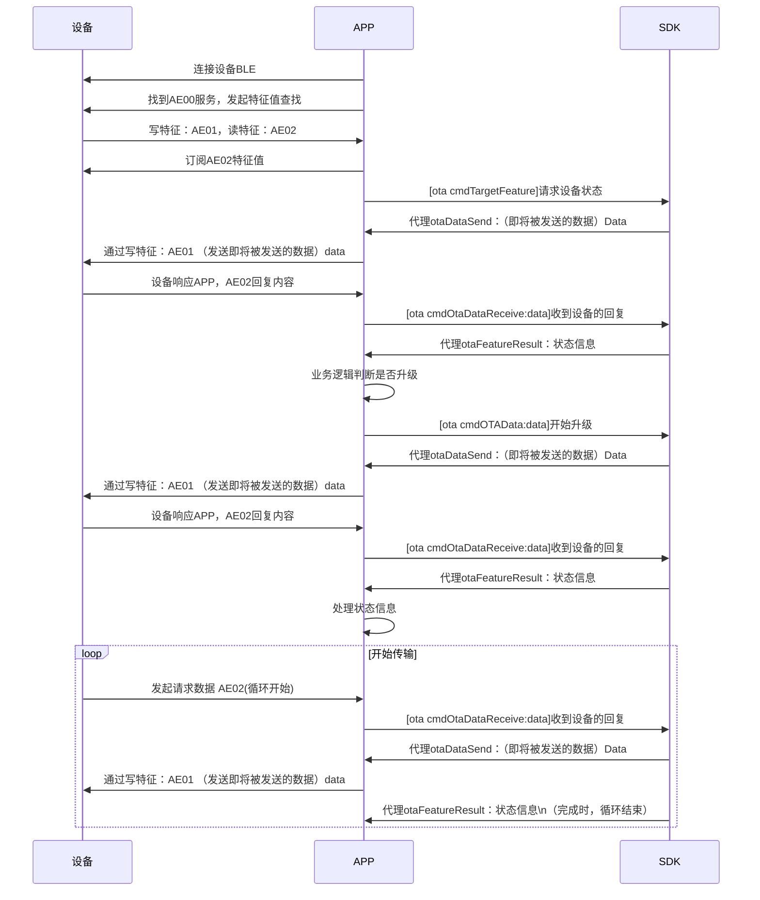

[toc]

# iOS杰理蓝牙OTA开发说明

- 数传：AC695X/AC608N/AC897/AD697N/AD698N/AC630N/AC632N

  手表：AC695X/JL701N/AC707N

  音箱：JL701N/AC897/AD697N/AD698N/700N

  对应固件 **SDK** 版本：支持 **RCSP** 协议 **OTA** 设备
- APP开发环境：iOS平台，iOS 12.0以上，Xcode 14.0以上
- 对应于苹果商店上的APP: **【杰理OTA】**
- 源码连接： https://github.com/Jieli-Tech/iOS-JL_OTA
- 杰理OTA对外开发文档：https://doc.zh-jieli.com/Apps/iOS/ota/zh-cn/master/index.html

## 声明

1. 本项⽬所参考、使⽤技术必须全部来源于公知技术信息，或⾃主创新设计。 
2. 本项⽬不得使⽤任何未经授权的第三⽅知识产权的技术信息。 
3. 如个⼈使⽤未经授权的第三⽅知识产权的技术信息，造成的经济损失和法律后果由个⼈承担。 


## SDK 版本

| 版本   | 日期       | 编辑     | 修改内容                                                     |
| ------ | ---------- | -------- | ------------------------------------------------------------ |
| V2.4.0 | 2025/10/13 | EzioChan | 1.  OTA超时处理的逻辑优化 <br />2. 增加重复序列号的容错处理<br />3. 增加特殊空间复用的升级支持 <br />4. 增加单备份SDK内部自动回连接口 |
| V2.3.1 | 2024/12/12 | EzioChan | 1. 分离日志打印库为独立运行模块; <br />2. 增加所有命令的超时检测; <br />3. 增加OTA升级的错误回调; <br />4. 增加OTA对象的对象管理容错; |
| V2.1.0 | 2023/3/28  | 陈冠杰   | 1. 性能优化<br>1.1 分离OTA模块为独立运行模块<br>1.2 分离设备认证配对业务为独立库<br>1.3 分离广播包解析模块为独立库 |
| V2.0.0 | 2021/10/14 | 凌 煊峰  | 1. 支持BLE单备份升级<br>2.支持BLE双备份升级<br>3.支持从浏览器传输OTA升级文件到APP<br>4.支持第三方电脑软件导入OTA升级文件<br>5.可选择BLE广播包过滤<br>6. 可选择BLE握手连接 |


## APP版本

| 版本 | 日期           | 编辑    | 修改内容                                       |
| ---- | -------------- | ------- | ---------------------------------------------- |
| V3.5.1 | 2025 年 10 月 13 日 | EzioChan | 修复已知问题；使用新的 SDK v2.4.0 |
| V3.5.0 | 2024 年 12 月 13 日 | EzioChan | 适配新 SDK 2.3.1 |
|V3.3.0  | 2023年03月23日|陈冠杰   |  适配新SDK2.1.0                                |
| V3.2.0 | 2023年1月11日 | 陈冠杰 | 重构UI页面，整理项目架构，新增自动化测试/广播音箱模块 |
| v2.0.0 | 2021年10月14日 | 凌 煊峰 | 蓝牙库新增根据ble地址对升级设备的回连；重写ota demo |
| v1.5.0 | 2021年09月08日 | 冯 洪鹏 | 优化自定义蓝牙SDK的接入方式                         |
| v1.2   | 2020年12月09日 | 冯 洪鹏 | 更新文档                                            |
| v1.1   | 2020年04月20日 | 冯 洪鹏 | 增加升级的错误回调                                  |
| v1.0   | 2019年09月09日 | 冯 洪鹏 | OTA升级功能 |

## 概述

本文档描述了如何使用已有SDK：JL_BLEKit.framework、JL_OTALib.framework、JL_AdvParse.framework、JL_HashPair.framework等一系列库实现iOS端协助设备端实现OTA升级的过程。本文会随着版本迭代而更新信息以及相关接入时的变化，开发者在使用上述开发库时可优先查看本文。


# 开发环境准备

- 对应的芯片类型：AC692x，BD29
- APP开发环境：iOS平台，iOS 12.0以上，Xcode 13.4以上
- 对应于苹果商店上的APP: **【杰理OTA】**
- 源码连接： https://github.com/Jieli-Tech/iOS-JL_OTA
- 杰理OTA对外开发文档：https://doc.zh-jieli.com/Apps/iOS/ota/zh-cn/master/index.html

## 注意事项

- `JL_BLEKit.framework`  依赖  `JLLogHelper.framework`，需要在导入 JL_BLEKit.framework 的时候需要同时导入这个库。

- 其他的SDK库诸如： `JL_OTALib.framework、 JL_HashPair.framework`等等，需要在导入的时候需要同时导入 `JLLogHelper.framework`。

JLLogHelper.framework 是默认开启了日志打印和存储的，如果开发者不需要记录，可以通过对应的接口关闭日志打印和存储。具体操作可以参考以下：

```objc
[JLLogManager clearLog]; // 清空日志
[JLLogManager setLog:false IsMore:false Level:JLLOG_COMPLETE]; // 关闭日志打印
[JLLogManager saveLogAsFile:false]; // 关闭日志存储
[JLLogManager logWithTimestamp:false]; // 关闭日志打印时间

//BetaBuild 内容
JLLogManager.saveLog(asFile: true)
JLLogManager.setLog(true, isMore: false, level: .COMPLETE)
JLLogManager.log(withTimestamp: true)
let path = NSSearchPathForDirectoriesInDomains(.documentDirectory, .userDomainMask, true).first! + "/abc.txt"
// 重置保存的路径
JLLogManager.redirectLogPath(path)
JLLogManager.clearLog()
 //回调所有的日志打印内容
JLLogManager.collectLog { str in
    print(str)
}
JLLogManager.logSomething("abcd")
```

## 备注

1. 随着对OTA库的抽离，以后的版本将会放弃使用臃肿的JL_BLEKit.framework进行OTA升级，此SDK后续将不再提供JL_BLEKit.framework的使用示例，更多的转向开发者自定义蓝牙管理，SDK内容专注于数据解析和流程控制。

2. 由于苹果公司发布的xcode开发工具**V14.0**版本之后，**不再支持 iOS10.0设备以及armv7架构**，我们也在计划淘汰掉这一部分的设备，请各位开发者及时升级Xcode，谢谢！


实现OTA升级必须导入的库：

> *JL_OTALib.framework*——OTA升级业务库
>
> *JL_AdvParse.framework*——杰理蓝牙设备广播包解析业务库
>
> *JL_HashPair.framework*——设备认证业务库
>
> JLLogHelper.framework——日志打印收集库


可选择导入的库：

> *JL_BLEKit.framework*

备注：当开发者想要使用杰理集成的蓝牙库（连接、其他通讯业务）时，需要导入当前SDK使用


添加以下权限：

>  *Privacy - Bluetooth Peripheral Usage Description*
>
> *Privacy - Bluetooth Always Usage Description*


# SDK使用的两种方式

- 自定义蓝牙连接方式（对应BleManager文件夹）；

  备注：**自定义蓝牙连接中所有BLE的操作都自行实现，SDK只负责对OTA数据包解析。**

- 使用JL_BLEKit.framework蓝牙连接方式（对应SDKBleManager文件夹）。


工程中已通过**BleHandle**文件夹内的**JLBleHandler**类进行了区分，具体可以参考实际源码。开发普通OTA升级流程只需要参考**Views**文件夹中的**NormalUpdate**文件内容即可。

## 1. 自定义蓝牙连接方式

### 1.1. JL_OTALib工作时序

**参考Demo：「JL_OTA项目的BleManager文件夹」**

**支持的功能：**

- BLE设备握手连接；
- 获取设备信息；
- OTA升级能实现；

**用到的库和相关类：**

用到的库：

> *JL_OTALib.framework*——OTA升级业务库
>
> *JL_AdvParse.framework*——杰理蓝牙设备广播包解析业务库
>
> *JL_HashPair.framework*——设备认证业务库
>
> JLLogHelper.framework——日志打印收集库

相关类说明：

**JL_OTAManager：**OTA升级业务管理类

| 平台 | 接口             | 功能                                           |
| ---- | ---------------- | ---------------------------------------------- |
| iOS  | cmdTargetFeature | 获取设备信息（是否需要升级/强制升级）          |
| iOS | cmdOtaDataReceive: | 设备端发过来的数据解析接口 |
| iOS  | cmdOTAData:Result:      | 请求进入loader状态,需要携带升数据bfu           |
| iOS  | cmdOTAData:Result:      | 进行数据传输（进入loader，重连后需要再次调用） |
| iOS  | cmdRebootDevice  | 重启设备命令                                   |

**JLHashHandler：**设备认证业务类

**JL_AdvParse：**广播包内容解析类

**BLE特征参数**

- **【服务号】**：AE00

- **【写】特征值**：AE01
- **【读 】特征值**：AE02

### 1.2. 初始化SDK 

```objective-c

@interface JLBleManager() <JL_OTAManagerDelegate,JLHashHandlerDelegate>
@property (strong, nonatomic) JLHashHandler *pairHash;

@end
- (instancetype)init {
    self = [super init];
    if (self) {
        _otaManager = [[JL_OTAManager alloc] init];
        _otaManager.delegate = self;        
        self.pairHash = [[JLHashHandler alloc] init];
        self.pairHash.delegate = self;
      
      	[JL_OTAManager logSDKVersion];
        [JLHashHandler sdkVersion];
    }
    return self;
}
```

### 1.3. BLE设备特征回调

```objective-c
#pragma mark 设备特征回调
- (void)peripheral:(CBPeripheral *)peripheral didDiscoverCharacteristicsForService:(CBService *)service error:(nullable NSError *)error {
    if (error) { NSLog(@"Err: Discovered Characteristics fail."); return; }
    
    if ([service.UUID.UUIDString isEqual:FLT_BLE_SERVICE]) {
        
        for (CBCharacteristic *character in service.characteristics) {
            /*--- RCSP ---*/
            if ([character.UUID.UUIDString isEqual:FLT_BLE_RCSP_W]) {
                NSLog(@"BLE Get Rcsp(Write) Channel ---> %@",character.UUID.UUIDString);
                self.mRcspWrite = character;
            }
            
            if ([character.UUID.UUIDString isEqual:FLT_BLE_RCSP_R]) {
                NSLog(@"BLE Get Rcsp(Read) Channel ---> %@",character.UUID.UUIDString);
                self.mRcspRead = character;
                [peripheral setNotifyValue:YES forCharacteristic:character];
                
                if(self.mRcspRead.properties == CBCharacteristicPropertyRead){
                    [peripheral readValueForCharacteristic:character];
                    NSLog(@"BLE  Rcsp(Read) Read Value For Characteristic.");
                }
            }
        }
    }
}
```


### 1.4. BLE更新通知特征的状态

```objective-c
#pragma mark 更新通知特征的状态
- (void)peripheral:(CBPeripheral *)peripheral didUpdateNotificationStateForCharacteristic:(nonnull CBCharacteristic *)characteristic error:(nullable NSError *)error {
    
    if (error) { NSLog(@"Err: Update NotificationState For Characteristic fail."); return; }
    
    if ([characteristic.service.UUID.UUIDString isEqual:FLT_BLE_SERVICE] &&
        [characteristic.UUID.UUIDString isEqual:FLT_BLE_RCSP_R]          &&
        characteristic.isNotifying == YES)
    {
        
        __weak typeof(self) weakSelf = self;
        self.bleMtu = [peripheral maximumWriteValueLengthForType:CBCharacteristicWriteWithoutResponse];
        NSLog(@"BLE ---> MTU:%lu",(unsigned long)self.bleMtu);
        if (self.isPaired == YES) {
            [_pairHash hashResetPair];
            dispatch_after(dispatch_time(DISPATCH_TIME_NOW, (int64_t)(0.3 * NSEC_PER_SEC)), dispatch_get_main_queue(), ^{
                //设备认证
                [self->_pairHash bluetoothPairingKey:self.pairKey Result:^(BOOL ret) {
                    if(ret){
                        weakSelf.lastUUID = peripheral.identifier.UUIDString;
                        weakSelf.lastBleMacAddress = nil;
                        [[NSNotificationCenter defaultCenter] postNotificationName:kFLT_BLE_PAIRED object:peripheral];
                        [weakSelf.otaManager noteEntityConnected];
                        weakSelf.pairStatus = YES;
                    }else{
                        NSLog(@"JL_Assist Err: bluetooth pairing fail.");
                        [weakSelf.bleManager cancelPeripheralConnection:peripheral];
                    }
                }];
            });
        }else{
            self.lastUUID = peripheral.identifier.UUIDString;
            self.lastBleMacAddress = nil;
            [[NSNotificationCenter defaultCenter] postNotificationName:kFLT_BLE_PAIRED object:peripheral];
            [self.otaManager noteEntityConnected];
        }
    }
    self.isConnected = YES;
}
```

### 1.5. BLE设备返回的数据

设备端返回的数据需要放入到SDK中解析，其中**设备认证部分**和**通讯部分**的处理是分开的

```objective-c
#pragma mark 设备返回的数据 GET
- (void)peripheral:(CBPeripheral *)peripheral didUpdateValueForCharacteristic:(CBCharacteristic *)characteristic error:(NSError *)error {
    if (error) { NSLog(@"Err: receive data fail."); return; }

    if(_isPaired == YES && _pairStatus == NO){
        //收到设备的认证交互数据
        [_pairHash inputPairData:characteristic.value];
    }else{
        //收到的设备数据，正常通讯数据
        [_otaManager cmdOtaDataReceive:characteristic.value];
    }

}

```

### 1.6. BLE设备断开连接

```objective-c
#pragma mark 设备断开连接
- (void)centralManager:(CBCentralManager *)central didDisconnectPeripheral:(CBPeripheral *)peripheral error:(nullable NSError *)error {
    NSLog(@"BLE Disconnect ---> Device %@ error:%d", peripheral.name, (int)error.code);
    
    [_otaManager noteEntityDisconnected];
    self.isConnected = NO;
    self.pairStatus = NO;
    /*--- UI刷新，设备断开 ---*/
    [[NSNotificationCenter defaultCenter] postNotificationName:kFLT_BLE_DISCONNECTED object:peripheral];
}
```

### 1.7. 手机蓝牙状态更新

```objective-c
//外部蓝牙，手机蓝牙状态回调处，实现以下：
#pragma mark - 蓝牙初始化 Callback
- (void)centralManagerDidUpdateState:(CBCentralManager *)central
{
   _mBleManagerState = central.state;
    
    if (_mBleManagerState != CBManagerStatePoweredOn) {
        self.mBlePeripheral = nil;
        self.blePeripheralArr = [NSMutableArray array];
    }
}
```

### 1.8. 获取设备信息 

BLE连接且配对后必须执行一次
```objective-c
	[_otaManager cmdTargetFeature];
```

### 1.9. 固件OTA升级

```objective-c
/**
 *  ota升级
 *  @param otaFilePath ota升级文件路径
 */
- (void)otaFuncWithFilePath:(NSString *)otaFilePath {
    NSLog(@"current otaFilePath ---> %@", otaFilePath);
    self.selectedOtaFilePath = otaFilePath;
    NSData *otaData = [[NSData alloc] initWithContentsOfFile:otaFilePath];
    
    [_otaManager cmdOTAData:otaData Result:^(JL_OTAResult result, float progress) {
        for (id<JLBleManagerOtaDelegate> objc in self.delegates) {
            if([objc respondsToSelector:@selector(otaProgressWithOtaResult:withProgress:)]){
                [objc otaProgressWithOtaResult:result withProgress:progress];
            }
        }
        
    }];
}
```

### 1.10. 取消固件OTA升级

```objective-c
- (void)otaFuncCancel:(CANCEL_CALLBACK _Nonnull)result{
    
    [_otaManager cmdOTACancelResult:^(uint8_t status, uint8_t sn, NSData * _Nullable data) {
        result(status);
    }];
}

```

### 1.11. OTAManager 的delegate回调处理

```objective-c
//MARK: - ota manager delegate callback

///取消升级回调
-(void)otaCancel{
    //TODO: 取消OTA升级回调
}

///升级状态进度回调
-(void)otaUpgradeResult:(JL_OTAResult)result Progress:(float)progress{
    //TODO: 设备升级过程回调，包括进度状态
}

///即将发送给设备的数据
-(void)otaDataSend:(NSData *)data{
  	//TODO: 开发者需要在这里要把数据发送到设备
    [self writeDataByCbp:data];
}
///设备信息回调
-(void)otaFeatureResult:(JL_OTAManager *)manager{
    
    NSLog(@"getDeviceInfo:%d",__LINE__);
    if (manager.otaStatus == JL_OtaStatusForce) {
        NSLog(@"---> 进入强制升级.");
        if (self.selectedOtaFilePath) {
            [self otaFuncWithFilePath:self.selectedOtaFilePath];
        } else {
            _getCallback(true);
        }
        return;
    } else {
        if (manager.otaHeadset == JL_OtaHeadsetYES) {
            NSLog(@"---> 进入强制升级: OTA另一只耳机.");
            if (self.selectedOtaFilePath) {
                [self otaFuncWithFilePath:self.selectedOtaFilePath];
            } else {
                _getCallback(true);
            }
            return;
        }
    }
    NSLog(@"---> 设备正常使用...");
    dispatch_async(dispatch_get_main_queue(), ^{
        /*--- 获取公共信息 ---*/
        [self->_otaManager cmdSystemFunction];
        self->_getCallback(false);
    });

}
```

### 1.12. 设备认证的delegate回调

```objective-c
//MARK: - Hash pair delegate callback
///即将发送到设备的认证数据
-(void)hashOnPairOutputData:(NSData *)data{
  //TODO: 开发者需要在这里要把数据发送到设备
   [self writeDataByCbp:data];
}

```

### 1.13. 数据发送

- iOS设备与固件通讯之间的最大MTU需要在连上后获取

```objective-c
self.bleMtu = [peripheral maximumWriteValueLengthForType:CBCharacteristicWriteWithoutResponse];
```

- 发送到设备的数据需要进行分包发送

代码参考如下：

```objective-c
//MARK: - data send manager

/// 需要分包发送
/// - Parameter data: 数据
-(void)writeDataByCbp:(NSData *)data{
    //    NSLog(@"%s:data:%@",__func__,data);
        if (_mBlePeripheral && self.mRcspWrite) {
            if (data.length > 0 ) {
                NSInteger len = data.length;
                while (len>0) {
                    if (len <= _bleMtu) {
                        NSData *mtuData = [data subdataWithRange:NSMakeRange(0, data.length)];
                        [_mBlePeripheral writeValue:mtuData
                          forCharacteristic:self.mRcspWrite
                                       type:CBCharacteristicWriteWithoutResponse];
                        len -= data.length;
                    }else{
                        NSData *mtuData = [data subdataWithRange:NSMakeRange(0, _bleMtu)];
                        [_mBlePeripheral writeValue:mtuData
                          forCharacteristic:self.mRcspWrite
                                       type:CBCharacteristicWriteWithoutResponse];
                        len -= _bleMtu;
                        data = [data subdataWithRange:NSMakeRange(_bleMtu, len)];
                    }
                }
            }
        }else{
            //需要先赋值写特征的内容
            NSLog(@"need to init");
        }
}
```


## 2. 使用JL_BLEKit.framework蓝牙连接方式

以下实现方法兼容于JL_BLEKit.framework的老版本：**V1.7.0/1.6.3/1.6.4**

区别于旧版SDK，新版JL_BLEKit.framework依赖于其他的SDK，所以在导入时应包含以下：

> *JL_OTALib.framework*——OTA升级业务库
>
> *JL_AdvParse.framework*——杰理蓝牙设备广播包解析业务库
>
> *JL_HashPair.framework*——设备认证业务库


###   2.1. SDK外部蓝牙管理

外部蓝牙管理，在使用JL_BLEKit.framework的同时，在蓝牙管理部分交由**外边（开发者自定义蓝牙）统筹管理**，可保障使用时的多样化。

**参考Demo：「 JL_OTA项目的 BleByAssist文件夹」**

**支持的功能**：

- BLE设备握手连接；
- 获取设备信息；
- OTA升级能实现；
- 注意：相对于**2.2.2**中描述的所有BLE操作都需自行实现；

**会用到的类**：

- **JL_Assist**：部署SDK类；(必须)
- **JL_ManagerM**：命令处理中心，所有的命令操作都集中于此；(必须)
- **JLModel_Device**：设备信息存储的数据模型；(必须)

**BLE参数**：

- **【服务号】**：AE00
- **【写】特征值**：AE01
- **【读 】特征值**：AE02


#### 2.1.1. 初始化SDK 

```objective-c
				/*--- JLSDK ADD ---*/
        _mAssist = [[JL_Assist alloc] init];
        _mAssist.mNeedPaired = _isPaired;             //是否需要握手配对
        /*--- 自定义配对码(16个字节配对码) ---*/
        //char pairkey[16] = {0x01,0x02,0x03,0x04,
        //                    0x01,0x02,0x03,0x04,
        //                    0x01,0x02,0x03,0x04,
        //                    0x01,0x02,0x03,0x04};
        //NSData *pairData = [NSData dataWithBytes:pairkey length:16];
        _mAssist.mPairKey    = nil;             //配对秘钥（或者自定义配对码pairData）
        _mAssist.mService    = FLT_BLE_SERVICE; //服务号
        _mAssist.mRcsp_W     = FLT_BLE_RCSP_W;  //特征「写」
        _mAssist.mRcsp_R     = FLT_BLE_RCSP_R;  //特征「读」

```

#### 2.1.2. BLE设备特征回调

```objective-c
#pragma mark - 设备特征回调
- (void)peripheral:(CBPeripheral *)peripheral didDiscoverCharacteristicsForService:(CBService *)service
             error:(nullable NSError *)error
{
    if (error) { NSLog(@"Err: Discovered Characteristics fail."); return; }
    
    /*--- JLSDK ADD ---*/
    [self.mAssist assistDiscoverCharacteristicsForService:service Peripheral:peripheral];
}
```


#### 2.1.3. BLE更新通知特征的状态

```objective-c
#pragma mark - 更新通知特征的状态
- (void)peripheral:(CBPeripheral *)peripheral didUpdateNotificationStateForCharacteristic:(nonnull CBCharacteristic *)characteristic
             error:(nullable NSError *)error
{
    if (error) { NSLog(@"Err: Update NotificationState For Characteristic fail."); return; }
    
    /*--- JLSDK ADD ---*/
    __weak typeof(self) weakSelf = self;
    [self.mAssist assistUpdateCharacteristic:characteristic Peripheral:peripheral Result:^(BOOL isPaired) {
        if (isPaired == YES) {
            weakSelf.lastUUID = peripheral.identifier.UUIDString;
            weakSelf.lastBleMacAddress = nil;
            
            weakSelf.mBlePeripheral = peripheral;
            /*--- UI配对成功 ---*/
            [JL_Tools post:kFLT_BLE_PAIRED Object:peripheral];
        } else {
            [weakSelf.bleManager cancelPeripheralConnection:peripheral];
        }
    }];
}


```

#### 2.1.4. BLE设备返回的数据

```objective-c
#pragma mark - 设备返回的数据 GET
- (void)peripheral:(CBPeripheral *)peripheral didUpdateValueForCharacteristic:(CBCharacteristic *)characteristic
             error:(NSError *)error
{
    if (error) { NSLog(@"Err: receive data fail."); return; }

    /*--- JLSDK ADD ---*/
    [self.mAssist assistUpdateValueForCharacteristic:characteristic];
}
```

#### 2.1.5. BLE设备断开连接

```objective-c
#pragma mark - 设备断开连接
- (void)centralManager:(CBCentralManager *)central didDisconnectPeripheral:(CBPeripheral *)peripheral
                 error:(nullable NSError *)error
{
    NSLog(@"BLE Disconnect ---> Device %@ error:%d", peripheral.name, (int)error.code);
    self.mBlePeripheral = nil;
    
    /*--- JLSDK ADD ---*/
    [self.mAssist assistDisconnectPeripheral:peripheral];
    
    /*--- UI刷新，设备断开 ---*/
    [JL_Tools post:kFLT_BLE_DISCONNECTED Object:peripheral];
}
```

#### 2.1.6. 手机蓝牙状态更新

```objective-c
//外部蓝牙，手机蓝牙状态回调处，实现以下：
#pragma mark - 蓝牙初始化 Callback
- (void)centralManagerDidUpdateState:(CBCentralManager *)central
{
    _mBleManagerState = central.state;
    
    /*--- JLSDK ADD ---*/
    [self.mAssist assistUpdateState:central.state];
    
    if (_mBleManagerState != CBManagerStatePoweredOn) {
        self.mBlePeripheral = nil;
        self.blePeripheralArr = [NSMutableArray array];
    }
}
```

#### 2.1.7. 获取设备信息 

**BLE连接且配对后必须执行一次**

```objective-c
	[self.mAssist.mCmdManager cmdTargetFeatureResult:^(NSArray * _Nullable array) {
        JL_CMDStatus st = [array[0] intValue];
        if (st == JL_CMDStatusSuccess) {
            JLModel_Device *model = [weakSelf.mAssist.mCmdManager outputDeviceModel];
            JL_OtaStatus upSt = model.otaStatus;
            if (upSt == JL_OtaStatusForce) {
                NSLog(@"---> 进入强制升级.");
                if (weakSelf.selectedOtaFilePath) {
                    [weakSelf otaFuncWithFilePath:weakSelf.selectedOtaFilePath];
                } else {
                    callback(true);
                }
                return;
            } else {
                if (model.otaHeadset == JL_OtaHeadsetYES) {
                    NSLog(@"---> 进入强制升级: OTA另一只耳机.");
                    if (weakSelf.selectedOtaFilePath) {
                        [weakSelf otaFuncWithFilePath:weakSelf.selectedOtaFilePath];
                    } else {
                        callback(true);
                    }
                    return;
                }
            }
            NSLog(@"---> 设备正常使用...");
            [JL_Tools mainTask:^{
                /*--- 获取公共信息 ---*/
                [weakSelf.mAssist.mCmdManager cmdGetSystemInfo:JL_FunctionCodeCOMMON Result:nil];
            }];
        } else {
            NSLog(@"---> ERROR：设备信息获取错误!");
        }
    }];
```

#### 2.1.8. 固件OTA升级

```objective-c
   //升级流程：连接设备-->获取设备信息-->是否强制升级-->(是)则必须调用该API去OTA升级;
     //                                                                        |_______>(否)则可以正常使用APP;

// 设置代理
@interface JLUpdateViewController () <JLBleManagerOtaDelegate>
- (void)viewDidLoad {
    [super viewDidLoad];
    
    // 设置ota升级过程状态回调代理
    [JLBleManager sharedInstance].otaDelegate = self;
}

/**
 *  选择文件后，点击启动OTA升级
 */
- (IBAction)updateBtnFunc:(id)sender {
    if (![JLBleManager sharedInstance].mBlePeripheral) {
        self.updateSeekLabel.text = @"";
        [DFUITools showText:@"请先连接设备" onView:self.view delay:1.0];
        return;
    }
    
    /*--- 获取设备信息 ---*/
    [[JLBleManager sharedInstance] otaFuncWithFilePath:_selectFilePath];
}
                                                                            
#pragma mark - JLBleManagerOtaDelegate

/**
 *  ota升级过程状态回调
 */
- (void)otaProgressWithOtaResult:(JL_OTAResult)result withProgress:(float)progress {
    if (result == JL_OTAResultUpgrading || result == JL_OTAResultPreparing) {
        if (result == JL_OTAResultPreparing) self.updateLabel.text = @"校验文件中";
        if (result == JL_OTAResultUpgrading) self.updateLabel.text = @"正在升级";
    } else if (result == JL_OTAResultPrepared) {
        NSLog(@"---> 检验文件【完成】");
    } else if (result == JL_OTAResultReconnect) {
        NSLog(@"---> OTA正在回连设备... %@", [JLBleManager sharedInstance].mBlePeripheral.name);
        [[JLBleManager sharedInstance] connectPeripheralWithUUID:[JLBleManager sharedInstance].lastUUID];
        [self otaTimeClose];//关闭超时检测
    } else if (result == JL_OTAResultReconnectWithMacAddr) {
        NSLog(@"---> OTA正在通过Mac Addr方式回连设备... %@", [JLBleManager sharedInstance].mBlePeripheral.name);
        JLModel_Device *model = [[JLBleManager sharedInstance].mAssist.mCmdManager outputDeviceModel];
        [JLBleManager sharedInstance].lastBleMacAddress = model.bleAddr;
        [[JLBleManager sharedInstance] startScanBLE];
        
        [self otaTimeClose];//关闭超时检测
    } else if (result == JL_OTAResultSuccess) {
        NSLog(@"--->升级成功.");
    } else if (result == JL_OTAResultReboot) {
        NSLog(@"--->设备重启.");
    } else {
        // 其余错误码详细 Command+点击JL_OTAResult 查看说明
        NSLog(@"ota update result: %d", result);
    }
}
```


### 2.2. SDK内部蓝牙管理

以下实现方法基于JL_BLEKit.framework的内部集成蓝牙连接方法，开发者无需管理蓝牙对象，只专注升级业务即可。

**参考Demo：「 JL_OTA项目的 SDKBleManager文件夹」**

**1. 支持的功能**：

- BLE设备的扫描、连接、断开、收发数据、回连功能；

- BLE设备过滤；

- BLE设备握手连接；

- BLE连接服务和特征值设置；

- 获取设备信息；

- OTA升级能实现；

**2. 会用到的类**：

- **JL_BLEUsage** ：可设置BLE过滤、握手、参数；

  ​                             查看蓝牙状态；

- **JL_Entity**：BLE设备的模型类，记录设备的相关信息（如名字、UUID、UID、PID等）；

- **JL_BLEMultiple**：BLE扫描、连接、断开、回连；

- **JL_ManagerM**：获取设备信息、OTA操作；
#### 2.2.1. 初始化SDK
```objective-c
				self.mBleMultiple = [[JL_BLEMultiple alloc] init];
        self.mBleMultiple.BLE_FILTER_ENABLE = YES;					// 过滤非杰理蓝牙设备
				// self.mBleMultiple.filterKey = nil;									// 一般情况赋值nil即可
        self.mBleMultiple.BLE_PAIR_ENABLE = YES;
				/*--- 自定义配对码(16个字节配对码) ---*/
        //char pairkey[16] = {0x01,0x02,0x03,0x04,
        //                    0x01,0x02,0x03,0x04,
        //                    0x01,0x02,0x03,0x04,
        //                    0x01,0x02,0x03,0x04};
        //NSData *pairData = [NSData dataWithBytes:pairkey length:16];
        // self.mBleMultiple.pairKey    = nil;             // 配对秘钥（或者自定义配对码pairData）
        self.mBleMultiple.BLE_TIMEOUT = 7;
```

#### 2.2.2. 扫描设备

```objective-c
    /*--- 搜索蓝牙设备 ---*/
    [[JL_RunSDK sharedInstance].mBleMultiple scanStart];

    // 监听通知【kJL_BLE_M_FOUND】【kJL_BLE_M_FOUND_SINGLE】回调设备数组
    [JL_Tools add:kJL_BLE_M_FOUND Action:@selector(reloadTableView) Own:self];
    [JL_Tools add:kJL_BLE_M_FOUND_SINGLE Action:@selector(reloadTableView) Own:self];
		
		// 获取设备数组
		- (void)reloadTableView {
    		self.btEnityList = [JL_RunSDK sharedInstance].mBleMultiple.blePeripheralArr;
    		if ([JL_RunSDK sharedInstance].mBleEntityM && ![self.btEnityList containsObject:[JL_RunSDK sharedInstance].mBleEntityM]) {
        		[self.btEnityList insertObject:[JL_RunSDK sharedInstance].mBleEntityM atIndex:0];
    		}
    		[self.subTableView reloadData];
		}
```

#### 2.2.3. 连接和断开设备

```objective-c
//API通过【JL_BLEMultiple】使用
/**
 连接设备
 @param entity 蓝牙设备类
 */
-(void)connectEntity:(JL_EntityM*)entity Result:(JL_EntityM_STATUS_BK)result;

/**
 断开连接
 */
-(void)disconnectEntity:(JL_EntityM*)entity Result:(JL_EntityM_STATUS_BK)result;
        
/**
 *  BLE状态通知
 */
extern NSString *kJL_BLE_M_FOUND;               //发现设备
extern NSString *kJL_BLE_M_FOUND_SINGLE;        //发现单个设备
extern NSString *kJL_BLE_M_ENTITY_CONNECTED;    //连接有更新
extern NSString *kJL_BLE_M_ENTITY_DISCONNECTED; //断开连接
extern NSString *kJL_BLE_M_ON;                  //BLE开启
extern NSString *kJL_BLE_M_OFF;                 //BLE关闭
extern NSString *kJL_BLE_M_EDR_CHANGE;          //经典蓝牙输出通道变化
```

#### 2.2.4. 获取设备信息(必须)

```objective-c
[[JL_RunSDK sharedInstance] getDeviceInfo:^(BOOL needForcedUpgrade) {
		if (needForcedUpgrade) {
				NSLog(@"设备需要强制升级，请到升级界面选择ota升级文件进行升级！");
				[self startLoadingView:@"设备需要强制升级，请到升级界面选择ota升级文件进行升级！" Delay:1.0];
		}
}];
```

#### 2.2.5. 固件OTA升级

```objective-c
   //升级流程：连接设备-->获取设备信息-->是否强制升级-->(是)则必须调用该API去OTA升级;
     //                                                                        |_______>(否)则可以正常使用APP;

// 设置代理
@interface JLUpdateViewController () <JL_RunSDKOtaDelegate>
// 设置ota升级过程状态回调代理
[JL_RunSDK sharedInstance].otaDelegate = self;

/**
 *  选择文件后，点击启动OTA升级
 */
- (IBAction)updateBtnFunc:(id)sender {
    if (![JL_RunSDK sharedInstance].mBleEntityM) {
        self.updateSeekLabel.text = @"";
        [DFUITools showText:@"请先连接设备" onView:self.view delay:1.0];
        return;
    }
    
    /*--- 获取设备信息 ---*/
    [[JL_RunSDK sharedInstance] otaFuncWithFilePath:_selectFilePath];
}

#pragma mark - JL_RunSDKOtaDelegate

/**
 *  ota升级过程状态回调
 */
- (void)otaProgressWithOtaResult:(JL_OTAResult)result withProgress:(float)progress {
    if (result == JL_OTAResultUpgrading || result == JL_OTAResultPreparing) {
        if (result == JL_OTAResultPreparing) self.updateLabel.text = @"校验文件中";
        if (result == JL_OTAResultUpgrading) self.updateLabel.text = @"正在升级";
    } else if (result == JL_OTAResultPrepared) {
        NSLog(@"---> 检验文件【完成】");
    } else if (result == JL_OTAResultReconnect) {
        NSLog(@"---> OTA正在回连设备... %@", [JL_RunSDK sharedInstance].mBleEntityM.mPeripheral.name);
    } else if (result == JL_OTAResultReconnectWithMacAddr) {
        NSLog(@"---> OTA正在通过Mac Addr方式回连设备... %@", [JL_RunSDK sharedInstance].mBleEntityM.mPeripheral.name);
    } else if (result == JL_OTAResultSuccess) {
        NSLog(@"--->升级成功.");
    } else if (result == JL_OTAResultReboot) {
        NSLog(@"--->设备重启.");
    } else {
        // 其余错误码详细 Command+点击JL_OTAResult 查看说明
        NSLog(@"ota update result: %d", result);
    }
}


```

