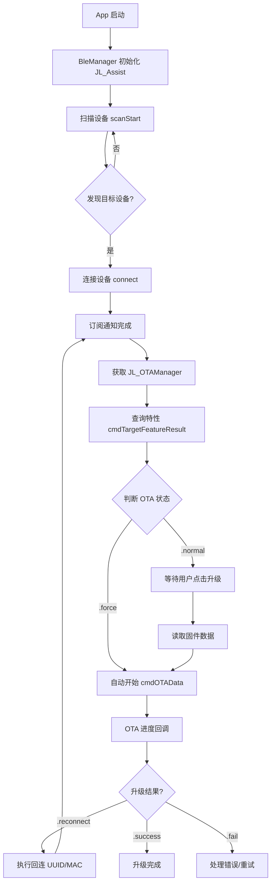
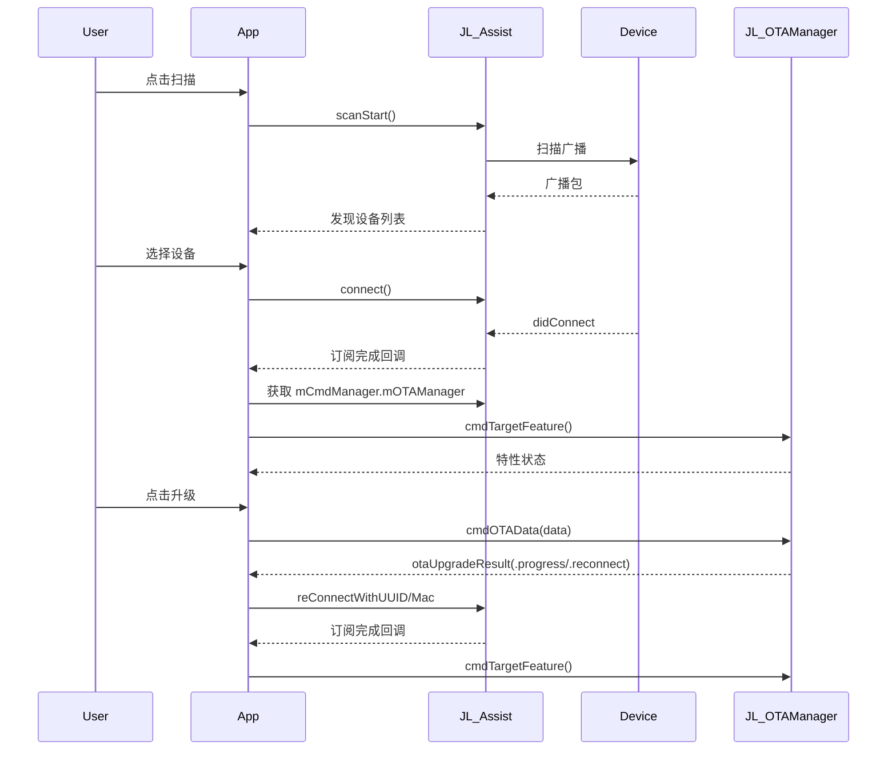

# OTA 升级开发文档示例（JL_Assist 自定义蓝牙连接）

> 说明：本文档示例严格遵循 `/doc/API 说明.md` 的接口规范，仅作为如何调用接口的实现参考，不包含对示例类文件的实现细节分析与总结。

## 1. 接口调用示例

### 1.1 Swift 示例（基于 JL_Assist 自定义蓝牙连接 + JL_OTAManager）

```swift
import UIKit
import CoreBluetooth
import JL_OTALib

/// OTA 示例控制器：演示 JL_Assist 自定义蓝牙连接与 JL_OTAManager 的标准调用流程
final class OTAExampleViewController: UIViewController, JL_OTAManagerDelegate {

    private let otaManager = JL_OTAManager.getOTAManager() // 接口文档：getOTAManager

    override func viewDidLoad() {
        super.viewDidLoad()
        // 1) 绑定 delegate（接口规范）
        otaManager.delegate = self // /doc/API 说明.md → 3.5 回调协议

        // 2) 扫描并连接设备
        BleManager.shared.startScan()
        // 选择设备后：BleManager.shared.connect(peripheral: sel)
    }

    // 3) 订阅完成后初始化 OTA 上下文（接口规范）
    private func onPeripheralReady(_ peripheral: CBPeripheral) {
        otaManager.mBLE_UUID = peripheral.identifier.uuidString
        otaManager.mBLE_NAME = peripheral.name ?? ""

        otaManager.noteEntityConnected() // /doc/API 说明.md → 3.4.1 设备操作
        otaManager.cmdTargetFeature()    // /doc/API 说明.md → 3.3.3 状态查询
    }

    // 4) 发起 OTA 升级（委托驱动进度，接口文档：cmdOTAData）
    private func startUpgrade(with data: Data) {
        otaManager.cmdOTAData(data) // /doc/API 说明.md → 3.4.2 OTA 操作
    }

    // 5) 取消升级（接口文档：cmdOTACancelResult）
    private func cancelUpgrade() {
        otaManager.cmdOTACancelResult { result in
            print("OTA 取消：\(result)")
        }
        otaManager.noteEntityDisconnected() // /doc/API 说明.md → 3.4.1 设备操作
    }

    // 6) 委托回调（接口文档：JL_OTAManagerDelegate）
    func otaUpgradeResult(_ result: JL_OTAResult, progress: Float) {
        print("升级状态：\(result) 进度：\(progress)") // /doc/API 说明.md → 3.5 回调协议
    }
    func otaDataSend(_ data: Data) {
        BleManager.shared.assistManager.bleWrite(data) // 通过 Assist 写入（示例）
    }
    func otaCancel() {}
    func otaFeatureResult(_ manager: JL_OTAManager) {}
}
```

### Objective‑C 示例

```objective-c
#import <JL_OTALib/JL_OTALib.h>

/**
 异常与重试策略示例（Objective‑C）
 展示基于自定义连接的回连与超时重试的基本处理
 */
@interface OTARetryGuideObjC : NSObject <JL_OTAManagerDelegate>
@property (nonatomic, strong) JL_OTAManager *otaManager;
@property (nonatomic, assign) NSInteger retryCount;
@end

@implementation OTARetryGuideObjC

- (instancetype)init {
    if (self = [super init]) {
        _otaManager = [JL_OTAManager getOTAManager];
        _retryCount = 0;
        _otaManager.delegate = self;
    }
    return self;
}

- (void)otaUpgradeResult:(JL_OTAResult)result Progress:(float)progress {
    switch (result) {
        case JL_OTAResultReconnect:
        case JL_OTAResultReconnectUpdateSource: {
            NSString *uuid = self.otaManager.mBLE_UUID;
            [[BleManager shared] reConnectWithUUID:uuid];
            break;
        }
        case JL_OTAResultReconnectWithMacAddr: {
            NSString *mac = self.otaManager.bleAddr;
            [[BleManager shared] reConnectWithMac:mac];
            break;
        }
        case JL_OTAResultFailCmdTimeout: {
            if (self.retryCount < 3) {
                self.retryCount += 1;
                NSTimeInterval delay = (NSTimeInterval)self.retryCount;
                dispatch_after(dispatch_time(DISPATCH_TIME_NOW, (int64_t)(delay * NSEC_PER_SEC)), dispatch_get_main_queue(), ^{
                    [self.otaManager cmdTargetFeature];
                });
            }
            break;
        }
        default:
            break;
    }
}

@end
```

源码对照：

- 扫描、连接、断开（源码摘录）：

  ```swift
  // 扫描与停止扫描
  func startScan() {
      centralManager.scanForPeripherals(withServices: nil, options: nil)
      DispatchQueue.main.asyncAfter(deadline: .now() + 3, execute: DispatchWorkItem(block: {
          self.stopScan()
      }))
  }

  func stopScan() {
      centralManager.stopScan()
  }

  // 连接与断开
  func connect(peripheral: CBPeripheral) {
      centralManager.connect(peripheral, options: nil)
  }

  func disconnect(peripheral: CBPeripheral) {
      centralManager.cancelPeripheralConnection(peripheral)
  }
  ```

- JL_Assist 初始化与参数配置（源码摘录）：

  ```swift
  private override init() {
      super.init()
      assistManager.mNeedPaired = true
      assistManager.mService = SERVICE_UUID
      assistManager.mRcsp_W = CHARACTERISTIC_WRITE
      assistManager.mRcsp_R = CHARACTERISTIC_NOTIFY
      JLLogManager.logLevel(.DEBUG, content: "BleManager init")
  }
  ```

- 重连与超时控制（源码摘录）：

  ```swift
  // 通过 UUID 重连设备并启动超时计时
  func reConnectWithUUID(uuid: String) {
      reconnectUUID = uuid
      reconnectMac = nil
      JLLogManager.logLevel(.DEBUG, content: "reConnectWithUUID: \(uuid)")
      startScan()
      startTimeout()
  }

  // 通过 MAC 地址重连设备并启动超时计时
  func reConnectWithMac(mac: String) {
      reconnectUUID = nil
      reconnectMac = mac
      JLLogManager.logLevel(.DEBUG, content: "reConnectWithMac: \(mac)")
      startScan()
      startTimeout()
  }

  // 超时控制
  @objc private func timeoutHandler() {
      timerCount += 1
      if timerCount >= maxCount {
          timer?.invalidate()
          timer = nil
          timerCount = 0
          JLLogManager.logLevel(.ERROR, content: "连接超时")
      }
  }
  private func startTimeout() {
      maxCount = 10
      timerCount = 0
      timer?.invalidate()
      timer = Timer.scheduledTimer(timeInterval: 1, target: self, selector: #selector(timeoutHandler), userInfo: nil, repeats: true)
      timer?.fire()
  }
  private func stopTimeout() {
      timer?.invalidate()
      timer = nil
      timerCount = 0
  }
  ```

- 扫描回调中的重连判断（UUID/MAC）（源码摘录）：

  ```swift
  func centralManager(_ central: CBCentralManager, didDiscover peripheral: CBPeripheral, advertisementData: [String : Any], rssi RSSI: NSNumber) {
      if peripheral.name != nil {
          JLLogManager.logLevel(.DEBUG, content: "发现设备: \(peripheral.name!)")
          discoverPeripherals.removeAll(where: { $0.identifier == peripheral.identifier })
          discoverPeripherals.append(peripheral)
          discoverPeripheralsSubject.accept(discoverPeripherals)
      }

      if reconnectUUID != nil {
          if peripheral.identifier.uuidString == reconnectUUID {
              reconnectUUID = nil
              stopScan()
              connect(peripheral: peripheral)
              return
          }
      }
      if reconnectMac != nil {
          guard let advData = advertisementData["kCBAdvDataManufacturerData"] as? Data else { return }
          guard let mac = reconnectMac else { return }
          if JLAdvParse.otaBleMacAddress(mac, isEqualToCBAdvDataManufacturerData: advData) {
              stopScan()
              reconnectMac = nil
              connect(peripheral: peripheral)
              return
          }
      }
  }
  ```

- 设备连接与服务特征发现（源码摘录）：

  ```swift
  func centralManager(_ central: CBCentralManager, didConnect peripheral: CBPeripheral) {
      JLLogManager.logLevel(.DEBUG, content: "连接设备成功")
      currentUUID = peripheral.identifier.uuidString
      peripheral.delegate = self
      peripheral.discoverServices(nil)
      stopScan()
      stopTimeout()
  }
  ```

  ```swift
  func peripheral(_ peripheral: CBPeripheral, didDiscoverServices error: Error?) {
      guard let services = peripheral.services else { return }
      for service in services {
          JLLogManager.logLevel(.DEBUG, content: "发现服务:\(service.uuid.uuidString)")
          if service.uuid.uuidString == SERVICE_UUID {
              peripheral.discoverCharacteristics(nil, for: service)
          }
      }
  }

  func peripheral(_ peripheral: CBPeripheral, didDiscoverCharacteristicsFor service: CBService, error: Error?) {
      assistManager.assistDiscoverCharacteristics(for: service, peripheral: peripheral)
  }
  ```

- 数据接收与通知订阅完成（源码摘录）：

  ```swift
  func peripheral(_ peripheral: CBPeripheral, didUpdateValueFor characteristic: CBCharacteristic, error: Error?) {
      assistManager.assistUpdateValue(for: characteristic)
  }

  func peripheral(_ peripheral: CBPeripheral, didUpdateNotificationStateFor characteristic: CBCharacteristic, error: (any Error)?) {
      assistManager.assistUpdate(characteristic, peripheral: peripheral) { result in
          if result {
              self.subNotifyInitSubject.onNext(peripheral)
          }
      }
  }

  func peripheralIsReady(toSendWriteWithoutResponse peripheral: CBPeripheral) {
      assistManager.assistDidReady()
  }
  ```

- 断开回调与状态重置（源码摘录）：

  ```swift
  func centralManager(_ central: CBCentralManager, didDisconnectPeripheral peripheral: CBPeripheral, error: Error?) {
      JLLogManager.logLevel(.DEBUG, content: "断开设备连接")
      currentUUID = ""
      assistManager.assistDisconnectPeripheral(peripheral)
      disconnectSubject.onNext(peripheral)
  }
  ```

- OTA 业务（获取 JL_OTAManager 并控制升级）（源码摘录）：

  ```swift
  BleManager.shared.subNotifyInitSubject
      .subscribe(onNext: { [weak self] peripheral in
          guard let self = self else { return }
          let assist = BleManager.shared.assistManager
          self.otaManager = assist.mCmdManager.mOTAManager
          assist.mCmdManager.cmdTargetFeatureResult { status, _, _ in
              guard let manager = self.otaManager else { return }
              if manager.otaStatus == .force  {
                  JLLogManager.logLevel(.DEBUG, content: "OTAActionManager otaFeatureResult force")
                  guard let otaData = self.otaData else { return }
                  manager.cmdOTAData(otaData) { result, progress in
                      self.otaUpgradeResult(result, progress: progress)
                  }
                  return
              }
              if manager.otaStatus == .normal,
                 manager.isSupportReuseSpaceOTA,
                 manager.otaSourceMode == .sourcesExtendModeFirmwareOnly {
                  JLLogManager.logLevel(.DEBUG, content: "OTAActionManager otaFeatureResult normal")
                  guard let otaData = self.otaData else { return }
                  manager.cmdOTAData(otaData) { result, progress in
                      self.otaUpgradeResult(result, progress: progress)
                  }
                  return
              }
              JLLogManager.logLevel(.DEBUG, content: "OTAActionManager otaFeatureResult normal")
              self.prepareUpdateSubject.onNext(Void())
          }
      })
      .disposed(by: disposeBag)
  ```

- 升级状态与进度回调（源码摘录）：

  ```swift
  private func otaUpgradeResult(_ result: JL_OTAResult, progress: Float) {
      if result == .reconnect || result == .reconnectUpdateSource {
          DispatchQueue.main.asyncAfter(deadline: .now() + 1) {
              guard let uuid = self.otaManager?.mBLE_UUID else { return }
              BleManager.shared.reConnectWithUUID(uuid: uuid)
          }
      }
      if result == .reconnectWithMacAddr {
          guard let mac = self.otaManager?.bleAddr else { return }
          DispatchQueue.main.asyncAfter(deadline: .now() + 1) {
              BleManager.shared.reConnectWithMac(mac: mac)
          }
      }
      updateStateSubject.onNext(result.description(progress))
  }
  ```

## 2. 典型使用场景

### 2.1 基于 JL_Assist 的连接与升级流程（UI 交互）

```swift
import UIKit
import RxSwift
import RxCocoa

/// 单页面演示的主控制器，负责展示扫描、更新按钮及状态与进度布局
final class AssistOTADemoController: UIViewController {
    // 省略 UI 初始化...
    private let disposeBag = DisposeBag()

    override func viewDidLoad() {
        super.viewDidLoad()
        // 绑定设备列表
        BleManager.shared.discoverPeripheralsSubject.bind(to: subTableView.rx.items(cellIdentifier: "cell")) { _, peripheral, cell in
            cell.textLabel?.text = peripheral.name
            if peripheral.identifier.uuidString == BleManager.shared.assistManager.mRcspPeripheral?.identifier.uuidString {
                cell.accessoryType = .checkmark
            } else {
                cell.accessoryType = .none
            }
        }.disposed(by: disposeBag)

        // 绑定升级状态
        OTAActionManager.shared.updateStateSubject.subscribe(onNext: { [weak self] state, progress in
            self?.stateLabel.text = state
            self?.progressView.progress = progress
        }).disposed(by: disposeBag)

        // 扫描与连接
        scanButton.rx.tap.subscribe(onNext: { BleManager.shared.startScan() }).disposed(by: disposeBag)
        tableView.rx.modelSelected(CBPeripheral.self).subscribe(onNext: { peripheral in
            if peripheral.identifier.uuidString == BleManager.shared.assistManager.mRcspPeripheral?.identifier.uuidString {
                BleManager.shared.disconnect(peripheral: peripheral)
            } else {
                BleManager.shared.connect(peripheral: peripheral)
            }
        }).disposed(by: disposeBag)

        // 开始升级
        startButton.rx.tap.subscribe(onNext: {
            guard let url = Bundle.main.url(forResource: "update", withExtension: "ufw"),
                  let data = try? Data(contentsOf: url) else { return }
            OTAActionManager.shared.startOta(data: data)
        }).disposed(by: disposeBag)
    }
}
```

## 3. 注意事项

- 自定义连接时需正确设置服务与特征值：`mService`、`mRcsp_W`、`mRcsp_R`
- 订阅通知完成后再发起 OTA 相关指令；必要时进行设备认证
- 回连请求必须执行；建议统一超时与重试策略，保障升级流程稳定
- 升级结束或失败后及时清理状态，避免后续交互异常

## 4. 流程图



## 5. 时序图



## 5. 快速上手

### 5.1 步骤概览
- 初始化 JL_Assist 并设置服务与特征值（`mService`/`mRcsp_W`/`mRcsp_R`）
- 扫描并连接设备（参考 `BleManager`）
- 订阅通知完成后，获取 `mCmdManager.mOTAManager`，查询设备特性 `cmdTargetFeatureResult`
- 根据业务自行获取固件数据（本地或服务端）
- 调用 `cmdOTAData` 发起升级，监听 `otaUpgradeResult` 更新进度与状态
- 需要时调用 `cmdOTACancelResult` 取消升级

### 5.2 Swift 快速上手示例

```swift
import JL_OTALib
import JL_BLEKit

/// OTA 快速上手示例控制器（初始化→连接→订阅→查询→升级）
final class AssistOTAQuickStart: NSObject {
    private var otaManager: JL_OTAManager?

    func onNotifyReady() {
        let assist = BleManager.shared.assistManager
        otaManager = assist.mCmdManager.mOTAManager
        assist.mCmdManager.cmdTargetFeatureResult { status, _, _ in
            if status == .success {
                // 视业务选择自动开更或等待用户点击
            }
        }
    }

    func startUpgrade(data: Data) {
        otaManager?.cmdOTAData(data) { result, progress in
            // 更新 UI 状态与进度
        }
    }
}
```
