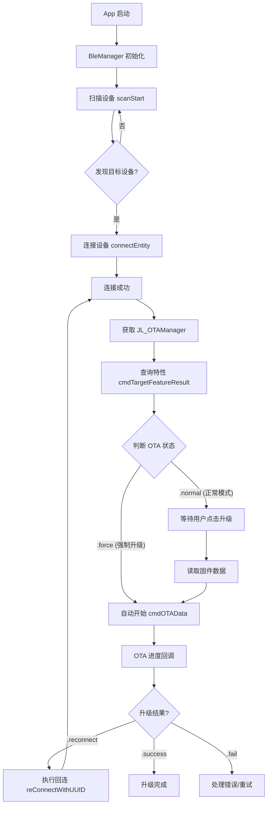
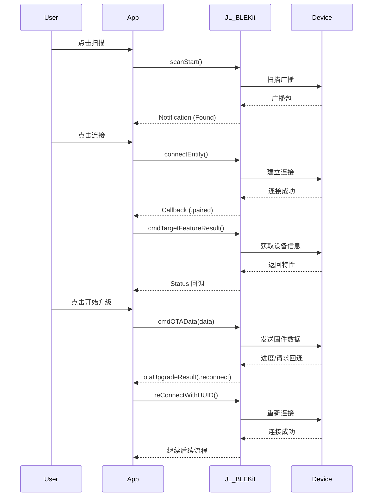

# OTA 升级开发示例 (SDK 蓝牙连接)

本文档演示如何使用 `JL_BLEKit` 框架进行蓝牙连接管理，并结合 `JL_OTALib` 进行设备 OTA 升级。相比原生蓝牙开发，使用 SDK 可以更快速地处理连接、认证与服务发现等流程。

## 1. 简介

- **适用场景**：使用杰理蓝牙 SDK (`JL_BLEKit`) 进行设备连接与交互的应用。
- **核心组件**：
  - `JL_BLEMultiple`：负责蓝牙扫描、连接、断开及状态维护。
  - `JL_EntityM`：代表一个连接的蓝牙设备对象，包含命令管理与 OTA 管理实例。
  - `JL_OTAManager`：负责具体的 OTA 升级指令与数据传输（从 `JL_EntityM` 中获取）。

## 2. 快速上手

### 2.1 步骤概览

1. **初始化**：配置 `JL_BLEMultiple`，设置过滤规则与超时参数。
2. **扫描连接**：调用 `scanStart` 发现设备，使用 `connectEntity` 建立连接。
3. **获取实例**：连接成功后，从回调的 `JL_EntityM` 对象中获取 `mCmdManager.mOTAManager`。
4. **特性查询**：调用 `cmdTargetFeatureResult` 检查设备状态（强制升级或正常模式）。
5. **开始升级**：读取本地固件数据，调用 `cmdOTAData` 开始升级。

## 3. 源码对照

以下代码片段展示了核心业务逻辑的实现。

### 3.1 蓝牙管理 (BleManager)

封装 `JL_BLEMultiple` 进行蓝牙操作。

#### 3.1.1 初始化与配置

```swift
private override init() {
    super.init()
    JLLogManager.logLevel(.DEBUG, content: "JL_BleMulit manager init")
    
    // 配置蓝牙过滤与服务 UUID
    bleMutipleManager.ble_PAIR_ENABLE = true
    bleMutipleManager.jl_BLE_SERVICE = SERVICE_UUID // "AE00"
    bleMutipleManager.jl_BLE_RCSP_W = CHARACTERISTIC_WRITE // "AE01"
    bleMutipleManager.jl_BLE_RCSP_R = CHARACTERISTIC_NOTIFY // "AE02"
    bleMutipleManager.ble_FILTER_ENABLE = false
    bleMutipleManager.ble_TIMEOUT = 10
    
    // 监听 SDK 发布的通知
    NotificationCenter.default.addObserver(self, selector: #selector(discoverEntity(_:)), name: NSNotification.Name(kJL_BLE_M_FOUND), object: nil)
    NotificationCenter.default.addObserver(self, selector: #selector(currentEntityUpdate(_:)), name: NSNotification.Name(kJL_BLE_M_ENTITY_CONNECTED), object: nil)
}
```

#### 3.1.2 扫描与连接

```swift
func startScan() {
    bleMutipleManager.scanStart()
}

// 发现设备回调处理
@objc private func discoverEntity(_ _: Notification) {
    let entities = bleMutipleManager.blePeripheralArr as! [JL_EntityM]
    var newEntitys: [JL_EntityM] = []
    // 过滤去重
    for entity in entities {
        if entity.mItem.count > 0 {
            newEntitys.removeAll(where: { $0.mUUID == entity.mUUID })
            newEntitys.append(entity)
        }
    }
    discoverPeripheralsSubject.accept(newEntitys)
}

// 发起连接
func connect(entity: JL_EntityM) {
    bleMutipleManager.connectEntity(entity) { status in
        JLLogManager.logLevel(.DEBUG, content: "connect status: \(status)")
        if status == .paired {
            self.subConnectInitSubject.onNext(entity)
        }
    }
}
```

#### 3.1.3 断开与重连

```swift
func disconnect(entity: JL_EntityM) {
    bleMutipleManager.disconnectEntity(entity) { status in
        if status == .paired {
            self.disconnectSubject.onNext(entity)
        }
    }
}

// 通过 UUID 重连（用于 OTA 过程中的回连）
func reConnectWithUUID(uuid: String) {
    guard let entity = bleMutipleManager.makeEntity(withUUID: uuid) else {
        JLLogManager.logLevel(.ERROR, content: "reConnectWithUUID: \(uuid) error")
        return
    }
    connect(entity: entity)
}

// 通过 MAC 地址重连
func reConnectWithMac(mac: String) {
    JLLogManager.logLevel(.DEBUG, content: "reConnectWithMac: \(mac)")
    bleMutipleManager.connectEntity(forMac: mac) { status in
        if status == .paired {
            self.reconnectSubject.onNext(Void())
        }
    }
}
```

### 3.2 OTA 业务逻辑 (OTAActionManager)

负责监听蓝牙连接状态并执行 OTA 流程。

#### 3.2.1 监听连接与获取 OTA 管理器

```swift
private func subscribe() {
    BleManager.shared.subConnectInitSubject
        .subscribe(onNext: { [weak self] entity in
            guard let self = self else { return }
            
            // 关键：从连接实体中获取 OTA 管理器
            self.otaManager = entity.mCmdManager.mOTAManager
            
            // 查询设备特性信息
            entity.mCmdManager.cmdTargetFeatureResult { status, _, _ in
                if status == .success {
                    self.handleFeatureResult()
                }
            }
        })
        .disposed(by: disposeBag)
}
```

#### 3.2.2 处理设备特性与状态

```swift
private func handleFeatureResult() {
    guard let manager = self.otaManager else { return }
    
    // 情况 1：强制升级模式（设备处于 OTA 模式或升级中断）
    if manager.otaStatus == .force  {
        JLLogManager.logLevel(.DEBUG, content: "OTAActionManager otaFeatureResult force")
        guard let otaData = self.otaData else { return }
        // 直接开始升级
        manager.cmdOTAData(otaData) { result, progress in
            self.otaUpgradeResult(result, progress: progress)
        }
        return
    }
    
    // 情况 2：支持断点续传/双备份且仅升级固件
    if manager.otaStatus == .normal,
       manager.isSupportReuseSpaceOTA,
       manager.otaSourceMode == .sourcesExtendModeFirmwareOnly {
        JLLogManager.logLevel(.DEBUG, content: "OTAActionManager otaFeatureResult normal & reuse")
        guard let otaData = self.otaData else { return }
        manager.cmdOTAData(otaData) { result, progress in
            self.otaUpgradeResult(result, progress: progress)
        }
        return
    }
    
    // 情况 3：正常模式，通知 UI 准备就绪，等待用户点击开始
    JLLogManager.logLevel(.DEBUG, content: "OTAActionManager otaFeatureResult normal")
    self.prepareUpdateSubject.onNext(Void())
}
```

#### 3.2.3 开始升级与回调处理

```swift
func startOta(data: Data) {
    otaData = data
    otaManager?.cmdOTAData(data) { result, progress in
        self.otaUpgradeResult(result, progress: progress)
    }
}

func otaUpgradeResult(_ result: JL_OTAResult, progress: Float) {
    // 处理回连请求
    if result == .reconnect || result == .reconnectUpdateSource {
        DispatchQueue.main.asyncAfter(deadline: .now() + 1) {
            guard let uuid = self.otaManager?.mBLE_UUID else { return }
            BleManager.shared.reConnectWithUUID(uuid: uuid)
        }
    }
    if result == .reconnectWithMacAddr {
        BleManager.shared.reConnectWithMac(mac: self.otaManager?.bleAddr ?? "")
    }
    
    // 更新 UI 状态
    updateStateSubject.onNext(result.description(progress))
}
```

## 4. 流程图



## 5. 时序图



## 6. 异常与重试建议

- **回连处理**：当 SDK 返回 `.reconnect` 或 `.reconnectWithMacAddr` 时，**必须**执行回连操作，否则升级无法完成。
- **超时控制**：建议在重连或命令发送时增加超时检测（如 10 秒无响应则视为失败）。
- **电量检查**：`.lowPower` 状态下应禁止升级。
- **状态清理**：升级结束或失败后，建议调用 `resetOTAManager()` 清理状态。

## 7. Objective-C 示例

由于 `JL_BLEKit` 是 Objective-C 框架，以下是对应的 OC 使用方式。

```objective-c
// 蓝牙连接回调
- (void)onJL_BLE_M_EntityConnected:(NSNotification *)note {
    JL_EntityM *entity = note.object;
    JL_OTAManager *otaManager = entity.mCmdManager.mOTAManager;
    
    // 查询特性
    [entity.mCmdManager cmdTargetFeatureResult:^(JL_OtaStatus status, JL_OTAResult result, float progress) {
        if (status == JL_OtaStatusSuccess) {
            // 准备升级数据
            NSString *path = [[NSBundle mainBundle] pathForResource:@"update" ofType:@"ufw"];
            NSData *data = [NSData dataWithContentsOfFile:path];
            
            // 开始升级
            [otaManager cmdOTAData:data Result:^(JL_OTAResult result, float progress) {
                [self handleOTAResult:result progress:progress manager:otaManager];
            }];
        }
    }];
}

// 处理升级结果
- (void)handleOTAResult:(JL_OTAResult)result progress:(float)progress manager:(JL_OTAManager *)mgr {
    if (result == JL_OTAResultReconnect) {
        // 使用 UUID 重连
        [[JL_BLEMultiple shared] makeEntityWithUUID:mgr.mBLE_UUID];
        [[JL_BLEMultiple shared] connectEntity:[[JL_BLEMultiple shared] bleConnectedArr].lastObject result:^(JL_EntityM_Status status) {
            // 处理重连结果
        }];
    }
}
```
