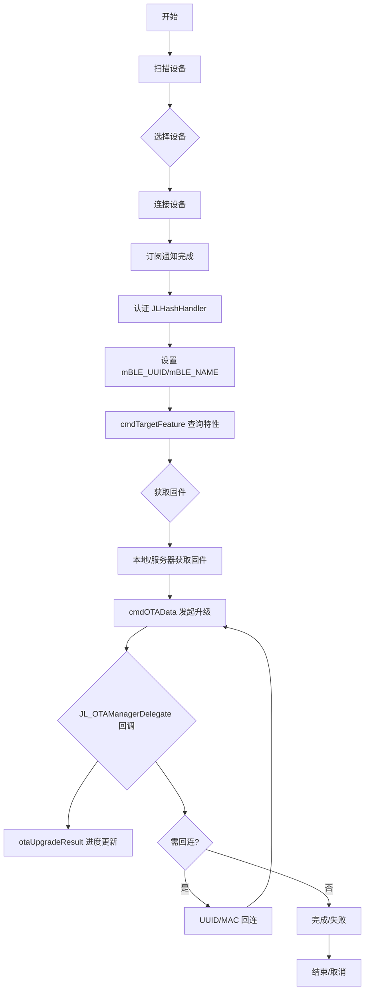
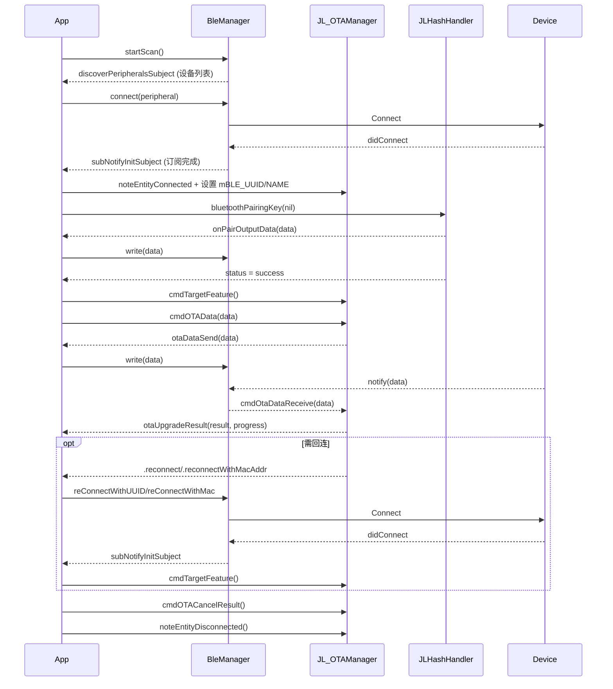

# OTA 升级开发文档示例

> 说明：本文档示例严格遵循 `/doc/API 说明.md` 的接口规范，仅作为如何调用接口的实现参考，不包含对示例类文件的实现细节分析与总结。

## 1. 接口调用示例

### 1.1 Swift 示例（基于 JL_OTAManager 与委托协议）

```swift
import UIKit
import CoreBluetooth
import JL_OTALib

/// OTA 示例控制器：演示 JL_OTAManager 标准调用流程
final class OTAExampleViewController: UIViewController, JL_OTAManagerDelegate {

    private let otaManager = JL_OTAManager.getOTAManager() // 接口文档：getOTAManager

    override func viewDidLoad() {
        super.viewDidLoad()
        // 1) 绑定 delegate（接口规范）
        otaManager.delegate = self // /doc/API 说明.md → 3.5 回调协议

        // 2) 扫描并连接设备
        BleManager.shared.startScan()
        // 选择设备后：BleManager.shared.connect(peripheral: sel)
    }

    // 3) 设备连接完成后初始化 OTA 上下文（接口规范）
    private func onPeripheralReady(_ peripheral: CBPeripheral) {
        otaManager.mBLE_UUID = peripheral.identifier.uuidString
        otaManager.mBLE_NAME = peripheral.name ?? ""

        otaManager.noteEntityConnected() // /doc/API 说明.md → 3.4.1 设备操作
        otaManager.cmdTargetFeature()    // /doc/API 说明.md → 3.3.3 状态查询
    }

    // 4) 发起 OTA 升级（委托驱动进度，接口文档：cmdOTAData）
    private func startUpgrade(with data: Data) {
        otaManager.cmdOTAData(data) // /doc/API 说明.md → 3.4.2 OTA 操作
    }

    // 5) 取消升级（接口文档：cmdOTACancelResult）
    private func cancelUpgrade() {
        otaManager.cmdOTACancelResult { result in
            print("OTA 取消：\(result)")
        }
        otaManager.noteEntityDisconnected() // /doc/API 说明.md → 3.4.1 设备操作
    }

    // 6) 委托回调（接口文档：JL_OTAManagerDelegate）
    func otaUpgradeResult(_ result: JL_OTAResult, progress: Float) {
        print("升级状态：\(result) 进度：\(progress)") // /doc/API 说明.md → 3.5 回调协议
    }
    func otaDataSend(_ data: Data) {
        BleManager.shared.write(data: data)
    }
    func otaCancel() {}
    func otaFeatureResult(_ manager: JL_OTAManager) {}
}
```

### 5.3 订阅完成后自动认证+查询特性（最小示例）

```swift
import RxSwift
import JL_OTALib
import JL_HashPair
import CoreBluetooth

/// 订阅完成后自动执行设备认证并查询特性的最小示例
final class OTAAutoAuthMini: JLHashHandlerDelegate {
    private let otaManager = JL_OTAManager.getOTAManager()
    private let auth = JLHashHandler()
    private let disposeBag = DisposeBag()
    private var isAuthed = false

    init() {
        auth.delegate = self

        // 订阅完成：设置设备标识并触发认证与特性查询
        BleManager.shared.subNotifyInitSubject
            .subscribe(onNext: { [weak self] peripheral in
                guard let self = self else { return }
                self.otaManager.mBLE_UUID = peripheral.identifier.uuidString
                self.otaManager.mBLE_NAME = peripheral.name ?? ""
                self.otaManager.noteEntityConnected()
                self.auth.hashResetPair()
                self.auth.bluetoothPairingKey(nil) { status in
                    if status {
                        self.isAuthed = true
                        self.otaManager.cmdTargetFeature()
                    }
                }
            })
            .disposed(by: disposeBag)

        // 数据通道：认证数据与 OTA 数据分流
        BleManager.shared.subNotifySubject
            .subscribe(onNext: { [weak self] data in
                guard let self = self else { return }
                if !self.isAuthed {
                    self.auth.inputPairData(data)
                    return
                }
                self.otaManager.cmdOtaDataReceive(data)
            })
            .disposed(by: disposeBag)
    }

    // 认证输出：写入设备
    func hash(onPairOutputData data: Data) {
        BleManager.shared.write(data: data)
    }
}
```

### Objective‑C 示例

```objective-c
#import <JL_OTALib/JL_OTALib.h>

/**
 异常与重试策略示例（Objective‑C）
 展示回连与超时重试的基本处理
 */
@interface OTARetryGuideObjC : NSObject <JL_OTAManagerDelegate>
@property (nonatomic, strong) JL_OTAManager *otaManager;
@property (nonatomic, assign) NSInteger retryCount;
@end

@implementation OTARetryGuideObjC

- (instancetype)init {
    if (self = [super init]) {
        _otaManager = [JL_OTAManager getOTAManager];
        _retryCount = 0;
        _otaManager.delegate = self;
    }
    return self;
}

- (void)otaUpgradeResult:(JL_OTAResult)result Progress:(float)progress {
    switch (result) {
        case JL_OTAResultReconnect: {
            NSString *uuid = self.otaManager.mBLE_UUID;
            [[BleManager shared] reConnectWithUUID:uuid];
            break;
        }
        case JL_OTAResultReconnectWithMacAddr: {
            NSString *mac = self.otaManager.bleAddr;
            [[BleManager shared] reConnectWithMac:mac];
            break;
        }
        case JL_OTAResultFailCmdTimeout: {
            if (self.retryCount < 3) {
                self.retryCount += 1;
                NSTimeInterval delay = (NSTimeInterval)self.retryCount;
                dispatch_after(dispatch_time(DISPATCH_TIME_NOW, (int64_t)(delay * NSEC_PER_SEC)), dispatch_get_main_queue(), ^{
                    [self.otaManager cmdTargetFeature];
                });
            }
            break;
        }
        case JL_OTAResultLowPower:
        case JL_OTAResultDisconnect:
        default:
            break;
    }
}

- (void)otaDataSend:(NSData *)data {
    [[BleManager shared] writeWithData:data];
}

@end
```

源码对照：

- 扫描、连接、断开、写入（源码摘录）：

  ```swift
  // 扫描与停止扫描
  func startScan() {
      centralManager.scanForPeripherals(withServices: nil, options: nil)
  }

  func stopScan() {
      centralManager.stopScan()
  }
  ```

  ```swift
  // 连接与断开
  func connect(peripheral: CBPeripheral) {
      centralManager.connect(peripheral, options: nil)
  }

  func disconnect(peripheral: CBPeripheral) {
      centralManager.cancelPeripheralConnection(peripheral)
  }
  ```

  ```swift
  // 数据写入（按设备 MTU 分片）
  func write(data: Data) {
      guard let characteristic = characteristicWrite, let peripheral = currentPeripheral else { return }
      let mtu = peripheral.maximumWriteValueLength(for: .withoutResponse)
      var len = 0
      while len < data.count {
          let end = min(len + mtu, data.count)
          peripheral.writeValue(data.subdata(in: len ..< end), for: characteristic, type: .withoutResponse)
          len = end
      }
  }
  ```

- 重连与超时控制（源码摘录）：

  ```swift
  // 通过 UUID 重连设备并启动超时计时
  func reConnectWithUUID(uuid: String) {
      reconnectUUID = uuid
      reconnectMac = nil
      JLLogManager.logLevel(.DEBUG, content: "reConnectWithUUID: \(uuid)")
      startScan()
      startTimeout()
  }

  // 通过 MAC 地址重连设备并启动超时计时
  func reConnectWithMac(mac: String) {
      reconnectUUID = nil
      reconnectMac = mac
      JLLogManager.logLevel(.DEBUG, content: "reConnectWithMac: \(mac)")
      startScan()
      startTimeout()
  }
  ```

  ```swift
  // 超时控制
  @objc private func timeoutHandler() {
      timerCount += 1
      if timerCount >= maxCount {
          timer?.invalidate()
          timer = nil
          timerCount = 0
          JLLogManager.logLevel(.ERROR, content: "连接超时")
      }
  }
  private func startTimeout() {
      maxCount = 10
      timerCount = 0
      timer?.invalidate()
      timer = Timer.scheduledTimer(timeInterval: 1, target: self, selector: #selector(timeoutHandler), userInfo: nil, repeats: true)
      timer?.fire()
  }
  private func stopTimeout() {
      timer?.invalidate()
      timer = nil
      timerCount = 0
  }
  ```

  ```swift
  // 扫描回调中的重连判断（UUID/MAC）
  func centralManager(_ central: CBCentralManager, didDiscover peripheral: CBPeripheral, advertisementData: [String : Any], rssi RSSI: NSNumber) {
      if peripheral.name != nil {
          JLLogManager.logLevel(.DEBUG, content: "发现设备: \(peripheral.name!)")
          discoverPeripherals.removeAll(where: { $0.identifier == peripheral.identifier })
          discoverPeripherals.append(peripheral)
          discoverPeripheralsSubject.accept(discoverPeripherals)
      }

      if reconnectUUID != nil {
          if peripheral.identifier.uuidString == reconnectUUID {
              reconnectUUID = nil
              stopScan()
              connect(peripheral: peripheral)
              return
          }
      }
      if reconnectMac != nil {
          guard let advData = advertisementData["kCBAdvDataManufacturerData"] as? Data else { return }
          guard let mac = reconnectMac else { return }
          if JLAdvParse.otaBleMacAddress(mac, isEqualToCBAdvDataManufacturerData: advData) {
              stopScan()
              reconnectMac = nil
              connect(peripheral: peripheral)
              return
          }
      }
  }
  ```

- 设备连接与服务特征发现（源码摘录）：

  ```swift
  func centralManager(_ central: CBCentralManager, didConnect peripheral: CBPeripheral) {
      JLLogManager.logLevel(.DEBUG, content: "连接设备成功")
      currentPeripheral = peripheral
      currentUUID = peripheral.identifier.uuidString
      peripheral.delegate = self
      peripheral.discoverServices(nil)
      stopScan()
      stopTimeout()
  }
  ```

  ```swift
  func peripheral(_ peripheral: CBPeripheral, didDiscoverServices error: Error?) {
      guard let services = peripheral.services else { return }
      for service in services {
          JLLogManager.logLevel(.DEBUG, content: "发现服务:\(service.uuid.uuidString)")
          if service.uuid.uuidString == SERVICE_UUID {
              peripheral.discoverCharacteristics(nil, for: service)
          }
      }
  }

  func peripheral(_ peripheral: CBPeripheral, didDiscoverCharacteristicsFor service: CBService, error: Error?) {
      guard let characteristics = service.characteristics else { return }
      for characteristic in characteristics {
          JLLogManager.logLevel(.DEBUG, content: "发现特征:\(characteristic.uuid.uuidString)")
          if characteristic.uuid.uuidString == CHARACTERISTIC_WRITE {
              characteristicWrite = characteristic
          } else if characteristic.uuid.uuidString == CHARACTERISTIC_NOTIFY {
              characteristicNotify = characteristic
              peripheral.setNotifyValue(true, for: characteristic)
          }
      }
  }
  
  func peripheral(_ peripheral: CBPeripheral, didUpdateValueFor characteristic: CBCharacteristic, error: Error?) {
      JLLogManager.logLevel(.DEBUG, content: "收到数据")
      guard let data = characteristic.value else { return }
      subNotifySubject.onNext(data)
  }
  ```

- 订阅通知完成（源码摘录）：

  ```swift
  func peripheral(_ peripheral: CBPeripheral, didUpdateNotificationStateFor characteristic: CBCharacteristic, error: (any Error)?) {
      JLLogManager.logLevel(.DEBUG, content: "通知状态改变")
      if characteristicWrite == nil {
          DispatchQueue.main.asyncAfter(deadline: .now() + 1) {
              JLLogManager.logLevel(.DEBUG, content: "进入初始化 wait 1")
              self.subNotifyInitSubject.onNext(peripheral)
          }
      } else {
          subNotifyInitSubject.onNext(peripheral)
          JLLogManager.logLevel(.DEBUG, content: "进入初始化")
      }
  }
  ```

- 设置设备标识、认证与特性查询（源码摘录）：

  ```swift
  BleManager.shared.subNotifySubject
      .subscribe(onNext: { [weak self] data in
          guard let self = self else { return }
          if !isAuthed, enableAuth {
              authManager.inputPairData(data)
              return
          }
          otaManager.cmdOtaDataReceive(data)
      })
      .disposed(by: disposeBag)
  ```

  ```swift
  BleManager.shared.subNotifyInitSubject
      .subscribe(onNext: { [weak self] peripheral in
          guard let self = self else { return }
          otaManager.mBLE_UUID = peripheral.identifier.uuidString
          otaManager.mBLE_NAME = peripheral.name ?? ""
          otaManager.noteEntityConnected()
          if !isAuthed, enableAuth {
              authManager.hashResetPair()
              self.authManager.bluetoothPairingKey(nil) { status in
                  if status {
                      JLLogManager.logLevel(.DEBUG, content: " 设备认证成功")
                      self.isAuthed = true
                      self.otaManager.cmdTargetFeature()
                  } else {
                      JLLogManager.logLevel(.ERROR, content: "设备认证失败")
                  }
              }
          }
      })
      .disposed(by: disposeBag)
  ```

- 发起与取消升级（源码摘录）：

  ```swift
  func startOta(data: Data) {
      otaData = data
      otaManager.cmdOTAData(data)
  }

  func stopOta() {
      otaManager.cmdOTACancelResult()
      otaManager.resetOTAManager()
  }
  ```

- 升级状态与进度回调（源码摘录）：

  ```swift
  func otaUpgradeResult(_ result: JL_OTAResult, progress: Float) {
      if result == .reconnect || result == .reconnectUpdateSource {
          DispatchQueue.main.asyncAfter(deadline: .now() + 1) {
              let uuid = self.otaManager.mBLE_UUID
              BleManager.shared.reConnectWithUUID(uuid: uuid)
          }
      }
      if result == .reconnectWithMacAddr {
          DispatchQueue.main.asyncAfter(deadline: .now() + 1) {
              BleManager.shared.reConnectWithMac(mac: self.otaManager.bleAddr)
          }
      }
      updateStateSubject.onNext(result.description(progress))
  }

  func otaDataSend(_ data: Data) {
      BleManager.shared.write(data: data)
  }
  ```

- UI 状态与进度绑定（源码摘录）：

  ```swift
  OTAActionManager.shared.updateStateSubject.subscribe(onNext: { [weak self] state, progress in
      guard let self = self else { return }
      self.stateLabel.text = state
      self.progress.progress = progress
  })
  .disposed(by: disposeBag)
  ```

- 断开回调与状态重置（源码摘录）：

  ```swift
  // 断开回调：清理当前设备并广播断开事件
  func centralManager(_ central: CBCentralManager, didDisconnectPeripheral peripheral: CBPeripheral, error: Error?) {
      JLLogManager.logLevel(.DEBUG, content: "断开设备连接")
      currentPeripheral = nil
      disconnectSubject.onNext(peripheral)
  }
  ```

  ```swift
  // 业务层订阅断开事件（可进行状态重置或提示）
  BleManager.shared.disconnectSubject
      .subscribe(onNext: { [weak self] peripheral in
          guard let self = self else { return }
          otaManager.noteEntityDisconnected()
          self.isAuthed = false
      })
      .disposed(by: disposeBag)
  ```

### 1.2 Objective‑C 示例（与接口文档方法签名一致）

```objective-c
#import <JL_OTALib/JL_OTALib.h>

@interface OTAExampleController : UIViewController <JL_OTAManagerDelegate>
@property (nonatomic, strong) JL_OTAManager *otaManager;
@end

@implementation OTAExampleController

- (void)viewDidLoad {
    [super viewDidLoad];
    self.otaManager = [JL_OTAManager getOTAManager]; // 3.1 初始化
    self.otaManager.delegate = self;                 // 3.5 回调协议

    // 扫描与连接按业务流程触发（示例见上方“扫描、连接、断开、写入”源码片段）
}

- (void)onPeripheralReady:(CBPeripheral *)peripheral {
    self.otaManager.mBLE_UUID = peripheral.identifier.UUIDString; // 3.3 属性
    self.otaManager.mBLE_NAME = peripheral.name ?: @"";
    [self.otaManager noteEntityConnected];                        // 3.4.1 设备操作
    [self.otaManager cmdTargetFeature];                           // 3.3.3 状态查询
}

- (void)startUpgradeWithData:(NSData *)data {
    [self.otaManager cmdOTAData:data Result:^(JL_OTAResult result) { // 3.4.2 OTA 操作
        NSLog(@"结果: %ld", (long)result);
    }];
}

- (void)cancelUpgrade {
    [self.otaManager cmdOTACancelResult:^(JL_OTAResult result) {    // 3.4.2 OTA 操作
        NSLog(@"取消: %ld", (long)result);
    }];
    [self.otaManager noteEntityDisconnected];                       // 3.4.1 设备操作
}

// 委托回调（3.5 回调协议）
- (void)otaUpgradeResult:(JL_OTAResult)result Progress:(float)progress {
    NSLog(@"进度: %.2f 状态: %ld", progress, (long)result);
}
- (void)otaDataSend:(NSData *)data {
    // 发送到设备：参考 /code/MiniDemo/.../BleManager.swift:66
}
- (void)otaCancel {}
- (void)otaFeatureResult:(JL_OTAManager *)manager {}

@end
```

<!-- 已按要求移除 JLOTAFile 示例，开发者可自行选择下载方式（本地或服务端）。 -->


## 2. 典型使用场景

### 2.1 设备连接与认证流程示例

```swift
import JL_HashPair
import JL_OTALib

/// 设备连接后的认证与特性查询示例（源位置参考）
final class DeviceAuthFlow: JLHashHandlerDelegate {
    private let auth = JLHashHandler()
    private let otaManager = JL_OTAManager.getOTAManager()

    init() { auth.delegate = self }

    func onPeripheralSubscribed(_ peripheral: CBPeripheral) {
        otaManager.mBLE_UUID = peripheral.identifier.uuidString  // /code/MiniDemo/.../OTAActionManager.swift:84
        otaManager.mBLE_NAME = peripheral.name ?? ""             // /code/MiniDemo/.../OTAActionManager.swift:85

        auth.hashResetPair()                                     // /code/MiniDemo/.../OTAActionManager.swift:88
        auth.bluetoothPairingKey(nil) { status in                // /code/MiniDemo/.../OTAActionManager.swift:91
            if status {
                self.otaManager.cmdTargetFeature()               // /doc/API 说明.md → 3.3.3
            }
        }
    }

    func hash(onPairOutputData data: Data) {
        BleManager.shared.write(data: data)                      // /code/MiniDemo/.../BleManager.swift:66
    }
}
```

 

### 2.2 固件获取与升级示例（本地文件）

```swift
import JL_OTALib

final class OTAFetchAndUpgrade {
    private let otaManager = JL_OTAManager.getOTAManager()

    func upgradeFromLocalBundle() {
        guard let dataUrl = Bundle.main.url(forResource: "update", withExtension: "ufw") else { return }
        guard let data = try? Data(contentsOf: dataUrl) else { return }
        otaManager.cmdOTAData(data)                                // /doc/API 说明.md → 3.4.2
    }
}
```

 

### 2.3 升级进度监控示例（UI 交互）

```swift
import UIKit
import JL_OTALib

final class OTAMonitorViewController: UIViewController, JL_OTAManagerDelegate {
    private let stateLabel = UILabel()
    private let progressView = UIProgressView(progressViewStyle: .default)
    private let otaManager = JL_OTAManager.getOTAManager()

    override func viewDidLoad() {
        super.viewDidLoad()
        otaManager.delegate = self                               // /doc/API 说明.md → 3.5 回调协议
    }

    func otaUpgradeResult(_ result: JL_OTAResult, progress: Float) {
        stateLabel.text = "\(result)"
        progressView.progress = progress                         // /doc/API 说明.md → 3.5 回调协议
    }
}
```

 


## 3. 注意事项

- 本文档示例仅作为 `/doc/API 说明.md` 接口的实现参考，不包含对示例类文件的实现细节分析与总结。
- 示例方法与参数严格遵循接口文档：
  - `JL_OTAManager.getOTAManager`、`noteEntityConnected`、`noteEntityDisconnected`
  - `cmdTargetFeature`、`cmdOTAData:(NSData*)data Result:(JL_OTA_RT)`、`cmdOTACancelResult:(JL_OTA_RESULT)`
  - 委托协议 `JL_OTAManagerDelegate`：`otaUpgradeResult:Progress:`、`otaDataSend:`、`otaCancel`、`otaFeatureResult:`
  
 - 结合实际工程时：
  - 数据发送可参考 `BleManager.write(data:)` 源码摘录
  - 设备连接与通知订阅完成后，再设置 `mBLE_UUID`/`mBLE_NAME` 并查询特性（见上方源码摘录）
  - UI 可直接用委托回调更新进度，或参考项目中的 Rx 中转方案。


 


## 5. 快速上手

### 5.1 步骤概览
- 初始化 `JL_OTAManager` 并设置 `delegate`
- 扫描并连接设备（参考 `BleManager`）
- 通知已连接、设置 `mBLE_UUID`/`mBLE_NAME`，查询设备特性 `cmdTargetFeature`
- （可选）执行设备认证 `JLHashHandler`，认证成功后继续查询特性
- 根据业务自行获取固件数据（本地或服务端）
- 调用 `cmdOTAData` 发起升级，监听 `JL_OTAManagerDelegate` 回调更新进度与状态
- 需要时调用 `cmdOTACancelResult` 取消升级并 `noteEntityDisconnected`

### 5.2 Swift 快速上手示例

```swift
import UIKit
import CoreBluetooth
import JL_OTALib
import JL_HashPair

/// OTA 快速上手示例控制器（初始化→连接→认证→查询→下载→升级）
final class OTAQuickStartController: UIViewController, JL_OTAManagerDelegate, JLHashHandlerDelegate {

    private let otaManager = JL_OTAManager.getOTAManager()
    private let auth = JLHashHandler()

    override func viewDidLoad() {
        super.viewDidLoad()
        otaManager.delegate = self                                 // /doc/API 说明.md → 3.5 回调协议
        auth.delegate = self
        BleManager.shared.startScan()
    }

    // 设备选择并连接（示例）
    func connect(_ peripheral: CBPeripheral) {
        BleManager.shared.connect(peripheral: peripheral)
    }

    // 订阅完成后设置上下文并查询特性（在业务中于订阅完成回调处调用）
    func onPeripheralReady(_ peripheral: CBPeripheral) {
        otaManager.mBLE_UUID = peripheral.identifier.uuidString
        otaManager.mBLE_NAME = peripheral.name ?? ""
        otaManager.noteEntityConnected()                            // /doc/API 说明.md → 3.4.1 设备操作
        otaManager.cmdTargetFeature()                               // /doc/API 说明.md → 3.3.3 状态查询
    }

    // 认证（可选）
    func startAuth() {
        auth.hashResetPair()
        auth.bluetoothPairingKey(nil) { status in
            if status { self.otaManager.cmdTargetFeature() }
        }
    }

    // 获取固件并升级（本地或服务器下载）
    func upgrade(with data: Data) {
        otaManager.cmdOTAData(data)                                 // /doc/API 说明.md → 3.4.2 OTA 操作
    }

    func cancelUpgrade() {
        otaManager.cmdOTACancelResult { _ in }                      // /doc/API 说明.md → 3.4.2 OTA 操作
        otaManager.noteEntityDisconnected()                         // /doc/API 说明.md → 3.4.1 设备操作
    }

    // MARK: JL_OTAManagerDelegate
    func otaUpgradeResult(_ result: JL_OTAResult, progress: Float) {
        print("状态: \(result) 进度: \(progress)")
    }
    func otaDataSend(_ data: Data) {
        BleManager.shared.write(data: data)
    }
    func otaCancel() {}
    func otaFeatureResult(_ manager: JL_OTAManager) {}

    // MARK: JLHashHandlerDelegate
    func hash(onPairOutputData data: Data) {
        BleManager.shared.write(data: data)
    }
}
```

 

### 5.3 Objective‑C 快速上手（与接口签名一致）

```objective-c
#import <JL_OTALib/JL_OTALib.h>

@interface OTAQuickStartController : UIViewController <JL_OTAManagerDelegate>
@property (nonatomic, strong) JL_OTAManager *otaManager;
@end

@implementation OTAQuickStartController
- (void)viewDidLoad {
    [super viewDidLoad];
    self.otaManager = [JL_OTAManager getOTAManager];               // /doc/API 说明.md → 3.1 初始化
    self.otaManager.delegate = self;                               // /doc/API 说明.md → 3.5 回调协议
}

- (void)onPeripheralReady:(CBPeripheral *)peripheral {
    self.otaManager.mBLE_UUID = peripheral.identifier.UUIDString;  // /doc/API 说明.md → 3.3 属性
    self.otaManager.mBLE_NAME = peripheral.name ?: @"";
    [self.otaManager noteEntityConnected];                         // /doc/API 说明.md → 3.4.1 设备操作
    [self.otaManager cmdTargetFeature];                            // /doc/API 说明.md → 3.3.3 状态查询
}

- (void)startUpgradeWithData:(NSData *)data {
    [self.otaManager cmdOTAData:data Result:^(JL_OTAResult result) { // /doc/API 说明.md → 3.4.2 OTA 操作
        NSLog(@"结果: %ld", (long)result);
    }];
}

- (void)cancelUpgrade {
    [self.otaManager cmdOTACancelResult:^(JL_OTAResult result) {}];  // /doc/API 说明.md → 3.4.2 OTA 操作
    [self.otaManager noteEntityDisconnected];                         // /doc/API 说明.md → 3.4.1 设备操作
}

- (void)otaUpgradeResult:(JL_OTAResult)result Progress:(float)progress { NSLog(@"进度: %.2f", progress); }
- (void)otaDataSend:(NSData *)data {}
- (void)otaCancel {}
- (void)otaFeatureResult:(JL_OTAManager *)manager {}
@end
```


## 6. 流程图




## 7. 时序图




## 8. 异常与重试建议

- 回连策略：当回调结果为 `.reconnect`、`.reconnectUpdateSource` 或 `.reconnectWithMacAddr` 时，优先触发 UUID/MAC 重连，并配合超时控制（如 10 秒）与最大重试次数限制。
- 超时重试：遇到 `.failCmdTimeout` 时，建议使用指数退避或线性退避在 1~3 次内重试关键操作（如重新 `cmdTargetFeature` 或继续 `cmdOTAData`）。
- 低电压：收到 `.lowPower` 应提示用户充电，不建议自动重试。
- 断开处理：收到 `.disconnect` 时清理当前设备状态并广播断开事件，根据业务决定是否自动回连或提示用户。
- 数据校验：`failVerification`、`failKey`、`failErrorFile`、`failLenght` 等应终止流程并重新获取或校验升级数据。
- 相同版本：`failSameVersion` 可提示无需升级或根据策略执行强制升级。
- 多设备冲突：`failedConnectMore` 提示用户断开其他设备后再试。

```swift
import JL_OTALib

/// 异常与重试示例：基于 otaUpgradeResult 的处理策略
final class OTARetryGuide: JL_OTAManagerDelegate {
    private let otaManager = JL_OTAManager.getOTAManager()
    private var retryCount = 0
    private let maxRetry = 3

    func otaUpgradeResult(_ result: JL_OTAResult, progress: Float) {
        switch result {
        case .reconnect, .reconnectUpdateSource:
            let uuid = otaManager.mBLE_UUID
            BleManager.shared.reConnectWithUUID(uuid: uuid)
        case .reconnectWithMacAddr:
            BleManager.shared.reConnectWithMac(mac: otaManager.bleAddr)
        case .failCmdTimeout:
            guard retryCount < maxRetry else { return }
            retryCount += 1
            let delay = Double(retryCount) // 线性退避：1s/2s/3s
            DispatchQueue.main.asyncAfter(deadline: .now() + delay) {
                // 可选策略：重新查询特性或继续推送数据
                self.otaManager.cmdTargetFeature()
            }
        case .lowPower:
            // 提示用户为设备充电
            break
        case .disconnect:
            // 清理状态，决定是否回连或提示用户
            break
        default:
            break
        }
    }

    func otaDataSend(_ data: Data) {
        BleManager.shared.write(data: data)
    }
}
```
